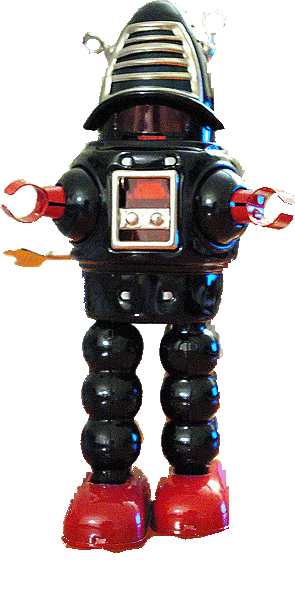

<link rel="stylesheet" href="css/theme/white.css" id="theme">

<!--section data-background-video="video.mp4,video.webm"-->

  

  

	<table>
		<tr><td></td></tr>
		<tr><td><h5>Guru Nanak Dev Engineering College<h5></td></tr>
		<tr><td><h6>Ludhiana, Punjab, India</h6></td></tr>
		<tr><td><h2 style="color:rgb(220,54,54); text-shadow: 2px 2px #000000" />SPATIAL OPERATORS</h2></td></tr>
	</table>

  

---

# Monadic Processing

* Each output pixel is a function of the corresponding input pixel
* The function is the same for all pixels

---

# Spatial Operators

* The function can capture something about the <strong>uniformity</strong> or <b>variation</b> over the local pixel <strong>window</strong> W

---

#  

> Best quote ever.
Note: speaker notes FTW!

